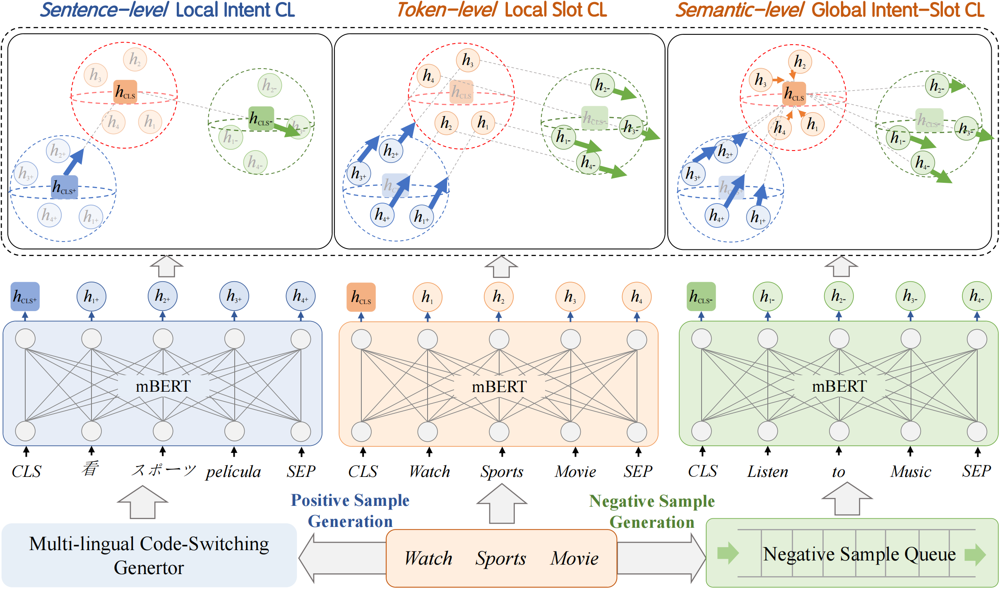

# GL-CLeF: A Global-Local Contrastive Learning Framework for Cross-lingual Spoken Language Understanding

 [](https://opensource.org/licenses/MIT) 


This repository contains the PyTorch implementation and the data of the paper: **GL-CLeF: A Global-Local Contrastive Learning Framework for Cross-lingual Spoken Language Understanding**. **[Libo Qin](https://scholar.google.com/citations?user=8lVpK1QAAAAJ)**, [Qiguang Chen](https://scholar.google.com/citations?user=8j8AfF0AAAAJ), [Tianbao Xie](https://scholar.google.com/citations?user=8sdGK_0AAAAJ), [Qixin Li](https://github.com/QixinLi), [Jian-Guang Lou](https://scholar.google.com/citations?user=alDxINIAAAAJ)*,* [Wanxiang Che](https://scholar.google.com/citations?user=SVlQ6IEAAAAJ),  [Min-Yen Kan](https://scholar.google.com/citations?user=aNVcd3EAAAAJ).  ***ACL2022***.[[PDF]](https://arxiv.org/pdf/2204.08325.pdf) .


This code has been written using PyTorch >= 1.9. If you use any source codes or the datasets included in this toolkit in your work, please cite the following paper. The bibtex are listed below:

<pre>
@misc{qin2022glclef,
      title={GL-CLeF: A Global-Local Contrastive Learning Framework for Cross-lingual Spoken Language Understanding}, 
      author={Libo Qin and Qiguang Chen and Tianbao Xie and Qixin Li and Jian-Guang Lou and Wanxiang Che and Min-Yen Kan},
      year={2022},
      eprint={2204.08325},
      archivePrefix={arXiv},
      primaryClass={cs.CL}
}
</pre>


## Abstract

Due to high data demands of current methods, attention to zero-shot cross-lingual spoken language understanding (SLU) has grown, as such approaches greatly reduce human annotation effort. However, existing models solely rely on shared parameters, which can only perform implicit alignment across languages. We present Global-Local Contrastive Learning Framework (GL-CLeF) to address this shortcoming. Specifically, we employ contrastive learning, leveraging bilingual dictionaries to construct multilingual views of the same utterance, then encourage their representations to be more similar than negative example pairs, which achieves explicitly align representations of similar sentences across languages. In addition, a key step in GL-CLeF is a proposed Local and Global component, which achieves a fine-grained cross-lingual transfer (i.e., sentence-level Local intent transfer, token-level Local slot transfer, and semantic-level Global transfer across intent and slot). Experiments on MultiATIS++ show that GL-CLeF achieves state-of-the-art performance and successfully pulls representations of similar sentences across languages closer.


##  Dataset

Please visit https://github.com/amazon-research/multiatis to get the dataset and put them into ``./MultiATIS++/data`` folder.

You can pick a portion of that `train` set as a `dev ` set to finetune parameters.

**Tips:** The complete MultiAtis++ is the concatenation of [MultiAtis](https://catalog.ldc.upenn.edu/LDC2019T04) and [MultiAtis++](https://catalog.ldc.upenn.edu/LDC2021T04)


## Model



## Preparation

The  packages we used are listed follow:

```
-- scikit-learn==0.24.2
-- numpy=1.21.1
-- pytorch==1.9.0
-- fitlog==0.9.13
-- tqdm==4.61.2
-- transformers==4.8.2
```

We highly suggest you using [Anaconda](https://www.anaconda.com/) to manage your python environment. If so, you can run the following command directly on the terminal to create the environment:

```
conda env create -f py37.yaml
```

## How to run it

The script **train.py** acts as a main function to the project, you can run the experiments by the following commands:

```shell
python -u train.py
```

Due to the different environments, you can adjust some parameters to get the desired results.

The parameters we use are configured in the  main function in `train.py`. If you need to adjust them, you can modify them in the relevant files or append parameters to the command.

Finally, you can check the results in `logs` folder. Also,  you can run fitlog command to visualize the results:

```shell
fitlog log log/
```

## How to use checkpoint

We provide our [finetuned checkpoint](https://pan.baidu.com/s/1IKpLpNx78riZV0o0vK0MhA?pwd=zru3) for your deeper study. And the paper results can be reproduced using the checkpoint we provide. The running command is shown below:

```shell
python -u train.py --load_weights True --load_model_path [MODEL_PATH] --train False
```

## Contact us

- Just feel free to open issues or send us email([Libo](mailto:lbqin@ir.hit.edu.cn), [Qiguang](mailto:charleschen2333@gmail.com)) if you have any problems or find some mistakes in this work.

